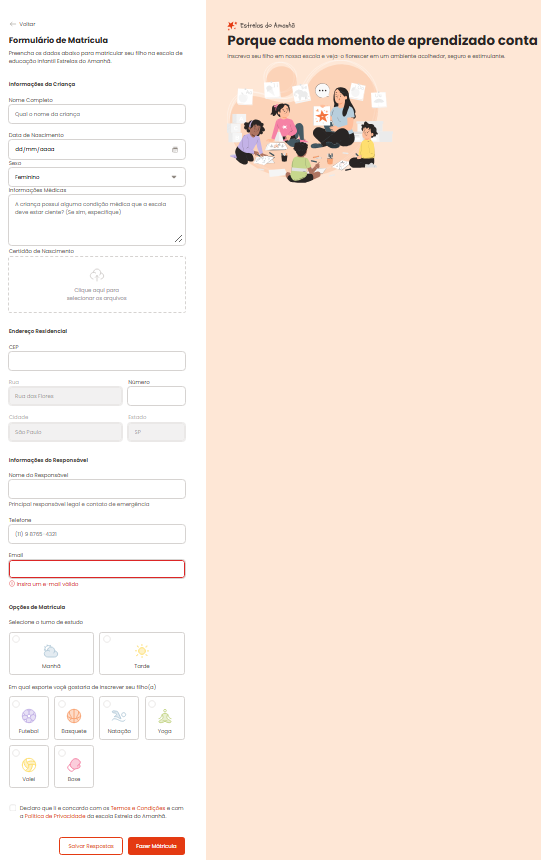

# 📝 Formulário de Matrícula — Estrelas do Amanhã

Formulário de matrícula desenvolvido em HTML/CSS para o projeto fictício "Estrelas do Amanhã".

## 📖 Sobre

Projeto voltado à prática de construção de formulários web, estruturação semântica em HTML e estilização com CSS.

## 🚀 Tecnologias

- HTML5
- CSS3

## 🔗 Acesse o projeto

https://maathxx.github.io/formulario-de-matricula/

## 👨🏽‍💻 Autor

Desenvolvido por **[Matheus Oliveira](https://github.com/maathxx)**.

